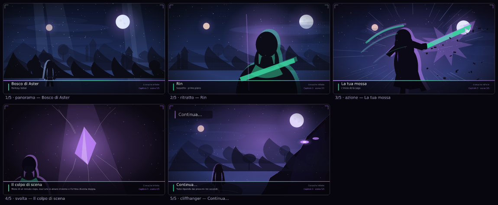
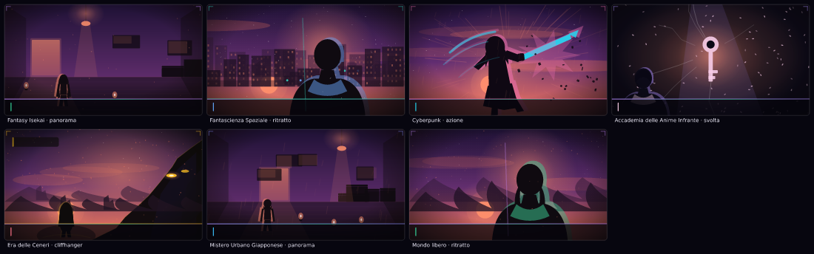
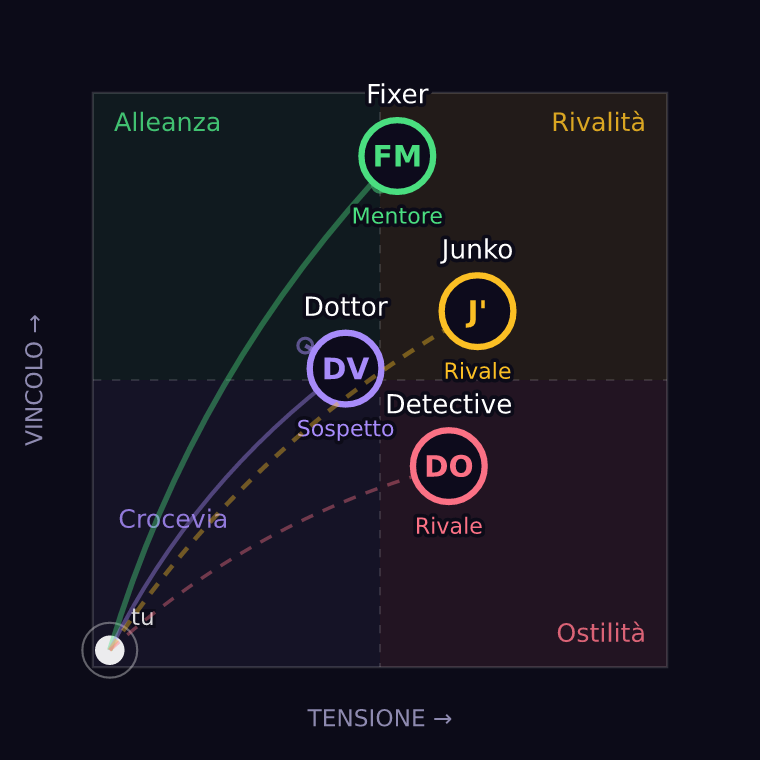

# MasterRPG — *Cronache Infinite*

> Un motore di gioco di ruolo narrativo **single-player** in stile *Playable Anime / Light Novel*.
> Interfaccia e contenuti **interamente in italiano**. Zero dipendenze esterne: gira con il solo Node.js.

L'utente sceglie un'ambientazione (o ne inventa una), crea il proprio protagonista e gioca una saga
a capitoli: l'**IA Game Master** scrive un capitolo per volta (150–200 parole), propone 3–4 scelte
rapide e accetta qualsiasi **Azione Personalizzata** scritta liberamente dal giocatore.

Ogni capitolo porta con sé **cinque illustrazioni** generate dal testo, ogni personaggio vive in un
**albero di fiducia a tre assi**, e il gioco è pronto per un **playtest reale** con registrazione
degli eventi e modulo di parere.

---

## 1. Avvio rapido

**Browser supportati**: Firefox 113+ (**consigliato**), Chrome/Edge/Brave 111+,
Safari 16.4+. Il gioco non carica nulla da Internet, non usa cookie e non
dipende da funzionalità di un solo browser: dettagli verificati in
[`docs/06-browser.md`](docs/06-browser.md).


```bash
node server/index.js          # oppure: npm start
# → http://localhost:3000
```

### Vuoi far giocare qualcuno adesso? Un solo comando

```bash
npm run playtest              # prepara tutto e stampa le istruzioni per il giocatore
```

Azzera i dati di prova, prepara una saga già pronta, avvia il server, mostra
l'indirizzo da aprire (anche dal telefono, sulla stessa rete Wi-Fi) e alla
chiusura con `Ctrl+C` stampa il **riepilogo della sessione**. Il protocollo
completo è in **[`docs/05-playtest.md`](docs/05-playtest.md)**.

Per far giocare qualcuno che non è sulla tua rete:

```bash
npm run playtest -- --pubblico      # apre un link https condivisibile (cloudflared/ngrok)
```

Nessun `npm install` necessario: il progetto usa **solo moduli nativi Node** (`node:http`, `node:fs`, `fetch`).
È possibile forzare una porta diversa con la variabile d'ambiente `PORT`.

### Motore narrativo: due modalità, zero blocchi

| Modalità | Quando si attiva | Cosa fa |
|---|---|---|
| **`llm`** (IA esterna) | Se è definita `OPENAI_API_KEY` (o `LLM_API_KEY`) | Interroga un endpoint compatibile OpenAI e chiede un JSON narrativo strutturato. |
| **`locale`** (default, offline) | Sempre disponibile come fallback | Il **Motore Narrativo Locale** compone il capitolo in italiano con un generatore procedurale seedato: lessico per ambientazione, battute degli NPC, colpi di scena e delta di stato. |

```bash
# Esempio con un LLM compatibile OpenAI (opzionale)
export OPENAI_API_KEY="sk-..."
export LLM_BASE_URL="https://api.openai.com/v1"   # default
export LLM_MODEL="gpt-4o-mini"                    # default
node server/index.js
```

Se la chiamata al modello fallisce (rete, quota, JSON malformato) il sistema **non si blocca mai**:
degrada automaticamente sul motore locale e lo segnala nell'interfaccia.

---

## 2. Le illustrazioni in una riga

Ogni capitolo genera **cinque scene** a partire dal proprio testo: il luogo, il volto dell'NPC, la tua
mossa, il colpo di scena e il cliffhanger. Sono vettoriali, deterministiche e istantanee: nessun
servizio esterno, nessun costo.



Sette ambientazioni, sette ore del giorno, nessun costo:



## 3. Funzionalità

1. **Interfaccia e motore di gioco (Single-Player Master)** — scelta dell'ambientazione dai preset o
   tramite testo libero; generazione di un capitolo per volta con scenario, dialoghi NPC e cliffhanger;
   3–4 scelte rapide + campo *Azione Personalizzata* (`public/index.html`, `server/motore/`).
2. **State Engine (memoria a lungo termine)** — pannello sempre accessibile **“Scheda del Personaggio e
   Storia”**: protagonista, inventario, relazioni con gli NPC, sinossi dei capitoli. Ad ogni nuovo prompt
   queste variabili vengono **iniettate implicitamente** nel contesto del Game Master
   (`server/stato/memoria.js` + `server/motore/prompt.js`), ed è possibile ispezionarle dal pulsante
   *“Memoria iniettata”*.
3. **Token Storia (crediti interni)** — bonus di benvenuto **1000**, costo **10 Token per capitolo**,
   pulsante **“Ottieni 500 Crediti Gratuiti”** che simula una missione giornaliera; una *Ricarica
   d'Emergenza* si sblocca sempre quando il saldo scende sotto il costo di un capitolo, così il gioco
   **non si blocca mai** (`server/crediti/portafoglio.js`).
4. **Localizzazione e stile** — tutta la UI e tutti i testi generati sono in italiano, con registro da
   light novel / anime: enfasi emotiva, dialoghi espressivi, colpi di scena a fine capitolo.
5. **Illustrazioni di scena (4-5 per capitolo)** — un motore SVG interno disegna cinque *key visual*
   per ogni capitolo: panorama del luogo all'ora giusta, primo piano dell'NPC, la mossa del giocatore,
   il colpo di scena e il cliffhanger. Deterministiche, istantanee, senza costi né servizi esterni
   (`server/illustrazioni/`). Vedi **[`docs/04-illustrazioni-e-relazioni.md`](docs/04-illustrazioni-e-relazioni.md)**.
6. **Albero di fiducia evoluto** — ogni NPC è descritto da **Vincolo**, **Tensione** e **Rispetto**;
   dalla combinazione nascono quattro quadranti narrativi (*Alleanza, Rivalità, Crocevia, Ostilità*),
   otto **tappe** del legame e uno storico capitolo per capitolo, mostrato in un piano cartesiano
   interattivo (`server/stato/relazioni.js`, `public/js/albero.js`).
7. **Giocabile da telefono** — punti di rottura a 1080/980/900/720/620/420 px, pannello a schede,
   modali a tutta larghezza, bersagli tattili ≥ 44 px, nessuno scorrimento orizzontale.
8. **Kit di playtest** — registro eventi locale (`dati/playtest/`), modulo di parere in quattro
   domande, riepilogo da terminale con suggerimenti automatici (`npm run playtest:riepilogo`).

### L'albero di fiducia in azione

Dopo 24 capitoli di una saga cyberpunk: quattro personaggi, quattro quadranti diversi, frecce che
mostrano come si è spostato ogni rapporto nell'ultimo capitolo.



---

## 4. Struttura del progetto

```
masterRPG/
├── server/
│   ├── index.js                 # server HTTP zero-dipendenze: statici + API REST
│   ├── api.js                   # rotte REST
│   ├── motore/
│   │   ├── narratore.js         # orchestratore: provider, validazione, applicazione stato
│   │   ├── prompt.js            # costruzione del prompt del Game Master (iniezione memoria)
│   │   ├── provider_llm.js      # client OpenAI-compatibile (opzionale)
│   │   ├── motore_locale.js     # generatore narrativo procedurale italiano (fallback offline)
│   │   ├── lessico.js           # banche lessicali per ambientazione + stile anime
│   │   └── schema.js            # normalizzazione/validazione del capitolo
│   ├── stato/
│   │   ├── modello.js           # creazione e mutazione dello stato di partita
│   │   ├── memoria.js           # State Engine: sinossi, relazioni, inventario, digest
│   │   └── archivio.js          # persistenza su file JSON (dati/partite/*.json)
│   └── crediti/
│       └── portafoglio.js       # Token Storia: bonus, spesa, ricarica gratuita
│   ├── stato/
│   │   ├── relazioni.js         # albero di fiducia: assi, quadranti, tappe, storico
│   ├── illustrazioni/
│   │   ├── palette.js           # cieli per momento, sfondi per ambientazione, accenti
│   │   └── scene.js             # motore SVG: 5 scene per capitolo, figure, cornici
│   └── playtest/
│       └── registro.js          # registro locale degli eventi di playtest (JSONL)
├── public/                      # interfaccia (nessun build step)
│   ├── index.html
│   ├── css/style.css
│   └── js/{app,api,setup,capitolo,scheda,albero,illustrazioni,portafoglio,playtest}.js
├── strumenti/                   # collaudi automatici e verifica statica
│   ├── avvia-playtest.js        # avvio guidato di una sessione di prova
│   ├── riepilogo-playtest.js    # numeri e pareri della sessione
│   ├── prova-motore.js          # 150 capitoli: vincoli, crediti, memoria
│   ├── prova-illustrazioni.js   # scene, determinismo, assi, rotte REST
│   ├── prova-compatibilita.js   # versioni minime per Firefox, Chrome e Safari
│   ├── prova-mobile.js          # layout da telefono: 39 controlli statici
│   ├── prova-interfaccia.js     # flusso di gioco completo (richiede jsdom)
│   ├── prova-anticrisi.js       # garanzia anti-blocco con saldo esaurito
│   └── verifica-html.js         # contratto fra HTML e JavaScript
└── docs/                        # modellazione dei flussi e architettura
    ├── 01-flussi-di-lavoro.md
    ├── 02-architettura.md
    ├── 03-modello-dati.md
    ├── 04-illustrazioni-e-relazioni.md
    ├── 05-playtest.md
    └── 06-browser.md
```

Documentazione dei flussi: **[`docs/01-flussi-di-lavoro.md`](docs/01-flussi-di-lavoro.md)**.

---

## 5. API REST

| Metodo | Rotta | Descrizione |
|---|---|---|
| `GET` | `/api/config` | Modalità motore attiva, costo per capitolo, regole crediti, catalogo ambientazioni. |
| `POST` | `/api/partite` | Crea una saga (ambientazione/preset o personalizzata, protagonista, tono). Accredita il bonus. |
| `GET` | `/api/partite` | Elenco delle saghe salvate. |
| `GET` | `/api/partite/:id` | Stato completo della partita. |
| `POST` | `/api/partite/:id/capitolo` | Genera il capitolo successivo (costo 10 Token Storia). |
| `POST` | `/api/partite/:id/ricarica` | Ricarica rapida gratuita: `{ modalita: "missione" \| "spot" \| "emergenza" }`. |
| `GET` | `/api/partite/:id/memoria` | Digest della memoria iniettata nel prompt (trasparenza dello State Engine). |
| `GET` | `/api/partite/:id/esporta` | Esporta la saga completa in Markdown. |
| `DELETE` | `/api/partite/:id` | Elimina una saga. |
| `GET` | `/api/partite/:id/illustrazioni/:capitolo` | Elenco delle 5 scene di un capitolo (titolo, didascalia, tipo, URL). |
| `GET` | `/api/partite/:id/illustrazioni/:capitolo/:indice` | L'illustrazione come SVG 1280×720, con cache lunga e immutabile. |
| `GET` | `/api/partite/:id/illustrazioni/:capitolo/:indice/prompt` | Prompt in inglese per un eventuale generatore di immagini esterno (opzionale). |
| `GET` | `/api/partite/:id/albero` | Albero di fiducia: nodi, assi, quadranti, tappe, storico. |
| `POST` | `/api/playtest/evento` | Registra un evento di playtest (solo in locale). |
| `GET` | `/api/playtest/riepilogo` | Riassunto della sessione: tempi, capitoli, scene aperte, pareri. |
| `GET` | `/api/playtest/eventi` | Elenco grezzo degli eventi registrati. |

---

## 6. Collaudi automatici

Il gioco non ha dipendenze, ma include una suite di verifica che ne dimostra il funzionamento.

```bash
npm run collaudo             # TUTTO in un comando: avvia da sé il server su una porta
                             # libera, esegue i sei collaudi e stampa il riepilogo finale
npm run collaudo:veloce      # come sopra, ma in versione ridotta (un minuto)
```

I singoli collaudi, se servono da soli (il server deve essere attivo):

```bash
npm run prova:motore         # 150 capitoli: lunghezza 150-200 parole, 3-4 scelte,
                             # dialoghi bilanciati, sinossi, crediti, ricarica d'emergenza
npm run prova:illustrazioni  # 5 scene per capitolo, determinismo, XML valido,
                             # tutte le ambientazioni, assi dell'albero, rotte REST
npm run prova:compatibilita  # Firefox/Chrome/Safari: versioni minime, tipi MIME,
                             # SVG ben formati per il parser di Firefox
npm run prova:mobile         # layout da telefono: nessuno scorrimento orizzontale,
                             # bersagli tattili, modali a tutta larghezza
npm run verifica             # controllo statico del contratto fra HTML e JavaScript
```

I due collaudi jsdom (`prova:interfaccia`, `prova:anticrisi`) richiedono la libreria
opzionale; `npm run collaudo` li salta con un avviso se non è installata:

```bash
npm install --no-save jsdom
npm run prova:interfaccia    # gioca una saga intera pilotando l'interfaccia reale
npm run prova:anticrisi      # saldo a 5 Token: la Ricarica d'Emergenza sblocca il gioco
```

Esito dell'ultima esecuzione — saga di 150 capitoli generata in 2 secondi:

| Collaudo | Esito |
|---|---|
| `prova-motore.js 150` | **1076/1076** verifiche · 28 000+ parole · 460 battute · 5 NPC · 6 luoghi |
| `prova-illustrazioni.js` | **16 444** verifiche · 60 scene distinte · 7 ambientazioni × 7 momenti · 0,5 ms per scena |
| `prova-compatibilita.js` | **52/52** verifiche su Firefox, Chrome e Safari (versioni minime, MIME, SVG) |
| `prova-mobile.js` | **39/39** verifiche sul layout da telefono |
| `prova-interfaccia.js` (jsdom) | **87** verifiche · flusso completo, galleria, albero di fiducia, modali |
| `prova-anticrisi.js` (jsdom) | **superato** · saldo esaurito → ricarica gratuita → la storia riprende |
| Saldo esaurito al capitolo 101 | Ricarica d'Emergenza gratuita, nessun blocco possibile |
| Memoria a lungo termine | 600 capitoli → 9 voci di sinossi, digest iniettato nel prompt |

---

## 7. Playtest

| Comando | Cosa fa |
|---|---|
| `npm run playtest` | Avvia una sessione di prova guidata: registro azzerato, saga pronta, istruzioni a schermo, riepilogo alla chiusura. |
| `npm run playtest:riepilogo` | Numeri della sessione: tempi per capitolo, dove si sono fermati i giocatori, voto medio, commenti, suggerimenti automatici. |
| `npm run playtest -- --saga-vuota` | Prova anche il percorso di creazione della saga. |
| `npm run playtest -- --conserva` | Non azzera il registro (più sessioni consecutive). |
| `npm run playtest -- --produzione` | Come un giocatore vero: nessuna modalità di prova. |

Il gioco registra gli eventi **solo in locale**, in `dati/playtest/eventi-*.jsonl`, senza dati
personali. Protocollo completo, domande da fare e griglia di interpretazione:
**[`docs/05-playtest.md`](docs/05-playtest.md)**.

---

## 8. Prossimi passi possibili

- Narrazione vocale dei capitoli (TTS) con voce per ogni NPC.
- Immagini da un modello esterno, usando i prompt già pronti (`…/illustrazioni/:cap/:idx/prompt`)
  come alternativa al motore SVG interno.
- Multi-saga con universo condiviso (personaggi ricorrenti tra partite diverse).
- Pannello «storia della saga» con la linea del tempo dei quattro quadranti.
