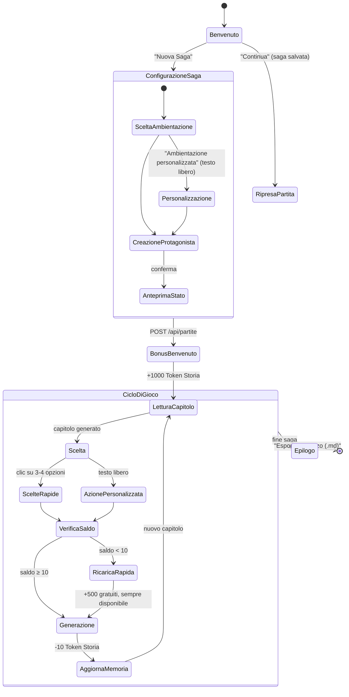
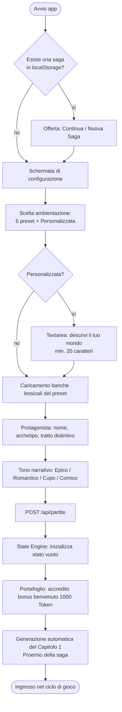
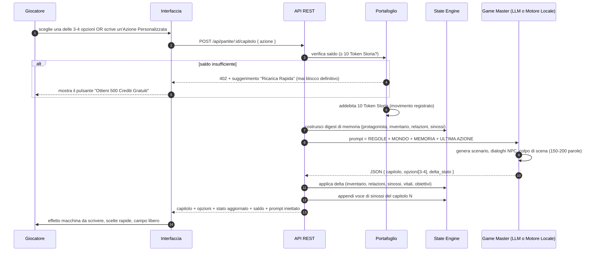
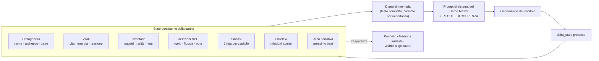
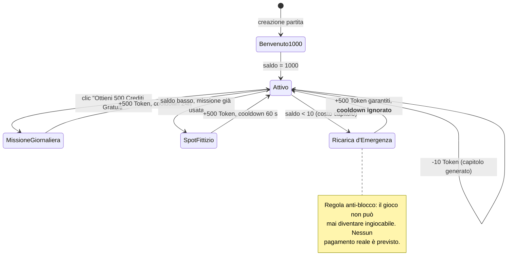
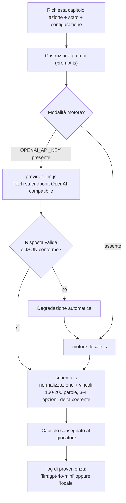
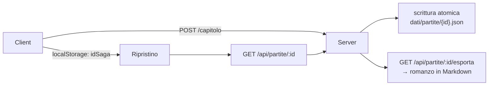
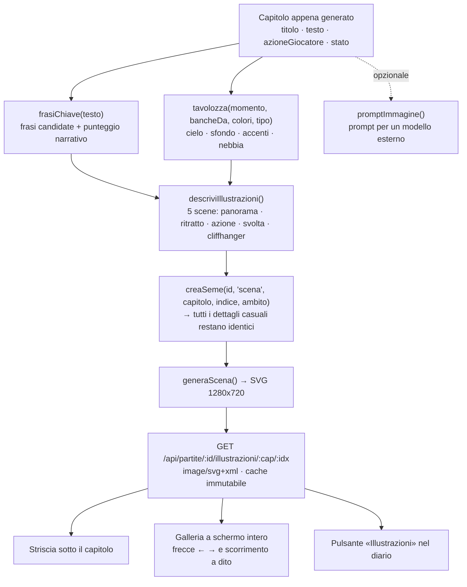
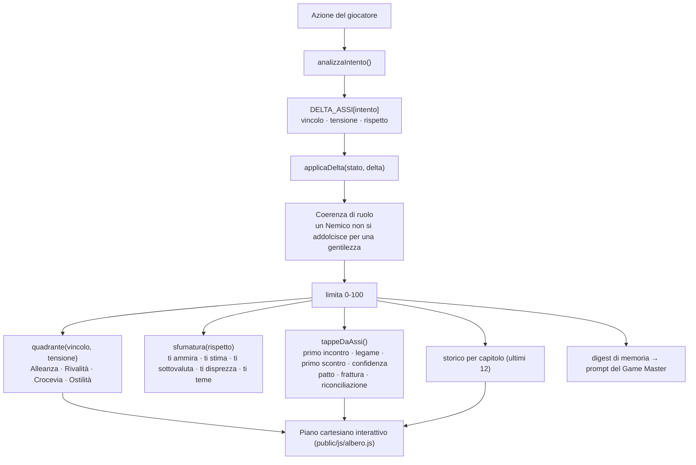

# 01 — Modellazione dei flussi di lavoro

**MasterRPG / Cronache Infinite** — gioco di ruolo narrativo single-player in stile *Playable Anime*.
Questo documento descrive la **struttura logica** dell'applicazione prima del codice: attori, stati,
flussi principali e regole di business.

---

## 1. Visione d'insieme

```
                        ┌───────────────────────────────────────────────┐
                        │              GIOCATORE (1 solo)               │
                        └───────────────┬───────────────────────────────┘
                                        │ sceglie / scrive / clicca
┌───────────────────────────────────────▼───────────────────────────────────────┐
│                          INTERFACCIA (Single Page App)                        │
│  Setup Saga  ·  Lettore Capitolo  ·  Scelte Rapide  ·  Azione Personalizzata   │
│  Scheda del Personaggio e Storia  ·  Portafoglio Token Storia  ·  Diario       │
└───────────────┬───────────────────────────────────────────────┬───────────────┘
                │ richieste REST relative                        │ lettura stato
┌───────────────▼───────────────────────────────────────────────▼───────────────┐
│                              API REST (Node.js)                               │
│  /capitolo   /ricarica   /memoria   /esporta   /partite                       │
└───┬───────────────┬───────────────────────┬───────────────────────┬───────────┘
    │               │                       │                       │
┌───▼─────────┐ ┌───▼──────────────┐ ┌──────▼─────────┐ ┌───────────▼─────────┐
│ PORTAFOGLIO │ │  NARRATORE       │ │ STATE ENGINE   │ │ ARCHIVIO            │
│ Token Storia│ │  (Game Master)   │ │ memoria lungo  │ │ persistenza JSON    │
│             │ │                  │ │ termine        │ │                     │
│ bonus 1000  │ │ provider LLM  ──┐│ │ inventario     │ │ dati/partite/*.json │
│ costo 10    │ │ motore locale ──┘│ │ relazioni NPC  │ │                     │
│ +500 gratis │ │                  │ │ sinossi        │ │                     │
└─────────────┘ └──────────────────┘ └────────────────┘ └─────────────────────┘
```

**Attori:** un solo giocatore umano. Il sistema è privo di autenticazione: la partita è identificata
da un `id` salvato nel `localStorage` del browser.

---

## 2. Macchina a stati dell'esperienza utente



---

## 3. Flusso A — Creazione della saga (setup)



**Regole di business**
- Nome protagonista obbligatorio (default suggerito in stile anime: *Rei*, *Kaito*, *Yuna*…).
- L'ambientazione personalizzata viene sintetizzata in un **contesto di mondo** riutilizzabile, non
  richiede alcuna configurazione tecnica da parte del giocatore.

---

## 4. Flusso B — Ciclo di un capitolo (cuore del gioco)



**Regole di business**
- Costo fisso: **10 Token Storia per capitolo generato** (la generazione del Capitolo 1 è inclusa nel bonus).
- L'azione del giocatore è sempre valida: se la scelta rapida non è gradita, il campo libero accetta
  qualsiasi testo (min. 3 caratteri).
- Ogni capitolo termina con un **cliffhanger** e una domanda diretta al protagonista.
- Il fallimento del provider IA esterno **non** interrompe la partita: subentra il motore locale
  (nessuna perdita di Token, il capitolo viene comunque consegnato).

---

## 5. Flusso C — State Engine (memoria a lungo termine)

L'obiettivo è evitare allucinazioni e perdita di memoria della trama: **ad ogni prompt narrativo** lo
stato viene richiamato implicitamente.



**Componenti del pannello “Scheda del Personaggio e Storia”**

| Blocco | Contenuto tracciato | Aggiornamento |
|---|---|---|
| Protagonista | nome, archetipo, tratto, vitali (vita/energia/tensione) | ogni capitolo |
| Inventario | oggetti ottenuti, rarità, note d'uso | quando il narratore assegna un oggetto |
| Relazioni | NPC incontrati, ruolo (Amico, Rivale, Mentore, Nemico…), fiducia 0-100 | quando un NPC compare o cambia atteggiamento |
| Sinossi | una riga per capitolo, generata automaticamente | fine di ogni capitolo |
| Obiettivi | missioni aperte/chiuse | su eventi chiave della trama |

**Regole di coerenza imposte al Game Master**
1. Non contraddire la sinossi: quanto scritto è canonico.
2. Usare solo oggetti presenti nell'inventario, salvo esplicita perdita/acquisizione.
3. Rispettare il ruolo relazionale degli NPC (un Rivale non si comporta come un Mentore senza motivo
   narrato nel capitolo).
4. Mantenere il tono scelto e il registro da light novel.

---

## 6. Flusso D — Sistema crediti “Token Storia”



**Regole di business**
- Valuta **fittizia**, nessun pagamento reale, nessuna integrazione di pagamento nel codice.
- Bonus di benvenuto: **1000 Token Storia** (accredito automatico alla creazione della saga).
- Costo di generazione: **10 Token Storia** per capitolo.
- Ricariche gratuite: **+500 Token** per missione giornaliera o spot fittizio simulato.
- **Garanzia anti-blocco**: se `saldo < costo`, la ricarica è sempre disponibile (cooldown ignorato).
- Tutti i movimenti (bonus, spesa, ricarica) sono registrati in un **estratto conto** ispezionabile.

---

## 7. Flusso E — Generazione narrativa: due provider, un solo contratto



**Il Motore Narrativo Locale** (fallback sempre disponibile, modalità offline) compone il capitolo con
una pipeline deterministica ma variabile:

```
Azione del giocatore
   └─> analisi intento (combattimento · dialogo · esplorazione · fuga · astuzia · cura · indagine)
        └─> scelta del luogo + atmosfera (banca lessicale dell'ambientazione)
             └─> selezione/creazione NPC coerente con le relazioni esistenti
                  └─> composizione dei blocchi:  Scenario → Azione → Dialogo NPC → Colpo di scena → Cliffhanger
                       └─> controllo del budget di parole (150-200) e dei vincoli di stile
                            └─> generazione delle 3-4 scelte rapide (prudente · audace · astuta · empatica)
                                 └─> calcolo dei delta di stato (inventario, relazione, vitali, obiettivi)
```

---

## 8. Flusso F — Persistenza e ripristino



- Ogni mutazione di stato viene salvata su disco in modo atomico (file temporaneo + rename).
- L'intera saga è esportabile come **romanzo Markdown**: capitoli, scelte operate, stato finale.
- Nessun dato personale reale è richiesto: solo il nome del protagonista scelto dal giocatore.

---

## 9. Flusso G — Illustrazioni di scena (5 per capitolo)



- Cinque scene per capitolo, sempre dello stesso tipo e nello stesso ordine.
- Il **determinismo** garantisce che le immagini di una saga non cambino mai: sono un bene della
  partita, non un effetto temporaneo.
- Nessun servizio esterno e nessun costo: il motore SVG è parte del gioco.

---

## 10. Flusso H — Albero di fiducia a tre assi



- Ogni variazione è **incrementale**: il narratore descrive il cambiamento, non il valore assoluto.
- Il gioco *sa* che un personaggio può piacerti e starti sulle scorte insieme: è la differenza fra
  «Rivalità» e «Ostilità».
- L'albero non è solo una schermata: gli stessi numeri entrano nel digest che il Game Master legge
  prima di scrivere il capitolo successivo.

---

## 11. Requisiti non funzionali

| Requisito | Implementazione |
|---|---|
| Tutto in italiano | UI, messaggi d'errore, contenuti generati, documentazione |
| Nessun blocco indefinito | Degradazione del provider IA + ricarica d'emergenza + retry locale |
| Nessun pagamento reale | La valuta è puramente fittizia, non esiste codice di pagamento |
| Single-player | Nessuna autenticazione, nessun canale realtime, nessuna condivisione |
| Zero dipendenze | Solo moduli nativi Node; nessun build step per il frontend |
| Ispezionabilità della memoria | Endpoint `/memoria` + pannello “Memoria iniettata” nella UI |
| Illustrazioni senza costi né attese | Motore SVG interno: < 1 ms per scena, zero servizi esterni |
| Giocabile da telefono | Punti di rottura 1080/980/900/720/620/420 px, bersagli ≥ 44 px, nessuno scorrimento orizzontale |
| Playtest misurabile | Registro eventi locale in JSONL + modulo di parere + riepilogo da terminale |
| Nessun dato personale | Il registro non contiene IP, email né nomi di giocatori |
